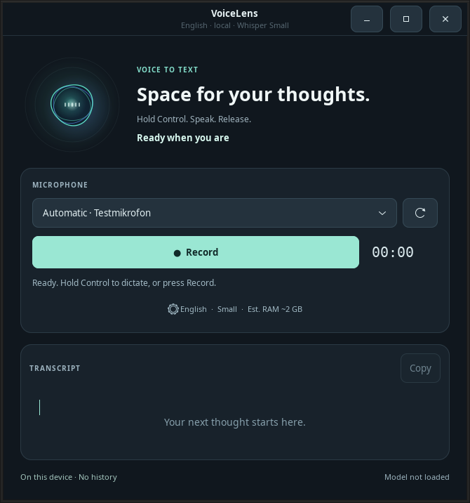

<p align="center"></p>

# VoiceLens

**Hold Control. Speak. Release. Your words appear at the caret.**

A native GTK 3 dictation app for Linux desktops, with local faster-whisper transcription.
No browser, web server, cloud transcription, telemetry, account or subscription.

**Early release:** the initial target is Ubuntu 24.04 / GNOME 46 on x86_64. Other distributions, architectures and GNOME versions need validation; this is not a universal Linux installer. Windows and macOS are not supported.

[Deutsche Kurzanleitung](docs/usage-de.md) · [Models and licenses](docs/models.md) · [Release notes](docs/releases/v0.2.0.md) · [Validation](docs/release.md)



*Interface preview with a simulated microphone; no recording.*

## What it does

- Detects microphone inputs during installation and startup, and refreshes them automatically while idle. Speaker-monitor sources and explicitly disconnected ports are excluded.
- Uses the current system default microphone for each recording, or a microphone you select. Muted devices are marked; VoiceLens never unmutes them for you.
- Finds complete local CTranslate2 Whisper models. On first use, prefers Small, then an available smaller model, then larger models. Your saved choice is preserved.
- Checks the local transcription runtime before enabling recording. Missing components have setup guidance in English and German.
- Supports English and German transcription and interface text.
- Loads Whisper only in a separate worker process. By default the worker exits and is reaped before completion is shown; optionally it stays loaded for a chosen number of minutes or permanently, so the next take starts without the loading delay.
- Provides a GNOME Control-hold shortcut and animated caret overlay. Record / Stop and manual copying also work in the app.
- Shows a live microphone level and the remaining recording budget while recording, with colour-coded state in the window.
- Optionally appends each result below the existing transcript, or copies it to the clipboard automatically. Both are off by default.
- Offers a transcript word count, a clear button, copy feedback, Escape to cancel and Ctrl+Shift+C to copy. The app menu lists the shortcuts and opens setup help.

## Install

Keep the extracted or cloned project at its final location: launchers refer to this folder.

### 1. Prepare dependencies

VoiceLens's installer is **offline**: it checks existing components and installs user launchers. It does not install system packages or download models.

On Ubuntu 24.04, the following is an **optional manual preparation step requiring network access and administrator rights**. Run it yourself if those packages are missing:

```sh
sudo apt install python3-gi python3-gi-cairo python3-cairo gir1.2-gtk-3.0 \
  librsvg2-common python3-venv ffmpeg pulseaudio-utils xdg-user-dirs desktop-file-utils
```

Use a running PulseAudio-compatible PipeWire or PulseAudio desktop session. For the GNOME helper, `gnome-extensions` must be available. Automatic insertion may also use AT-SPI (`gir1.2-atspi-2.0`); manual copying remains available.

Prepare a **separate VoiceLens environment** from the project directory. These manual commands download Python packages:

```sh
/usr/bin/python3 -m venv .venv
.venv/bin/python3 -m pip install -r requirements-stt.txt
```

For a computer without network access, copy compatible wheels and prepare the environment with `.venv/bin/python3 -m pip install --no-index --find-links /path/to/wheels -r requirements-stt.txt`. The wheel collection must contain all dependencies for that computer's Python version and architecture.

`requirements-stt.txt` pins faster-whisper. The optional [runtime constraints](requirements-stt-constraints.txt) record dependency versions from the Python 3.11 / Linux x86_64 speech runtime used for the functional smoke test. Add `-c requirements-stt-constraints.txt` when reproducing those versions in a compatible environment. These are version pins, not a wheel archive or a lockfile with package hashes; a fresh install using Ubuntu's Python 3.12 still needs validation.

The GTK interface always runs with `/usr/bin/python3`. The transcription runtime is discovered in the project `.venv`, then `~/.local/share/voicelens/venv`, then system Python. Prefer a dedicated VoiceLens environment; the app does not search other applications' environments. An existing interpreter can be selected with an absolute `VOICELENS_STT_PYTHON` path. See [runtime search order](docs/ops.md).

### 2. Provide one local model

Existing Hugging Face caches are detected automatically, including `HF_HUB_CACHE`, `HUGGINGFACE_HUB_CACHE`, `HF_HOME` and `XDG_CACHE_HOME` locations.

Alternatively, copy a complete model folder to:

```text
~/.local/share/voicelens/models/small/
    config.json
    model.bin
    tokenizer.json
    vocabulary.txt   (or vocabulary.json)
```

`XDG_DATA_HOME` is respected. Use the corresponding model ID as the directory name for other sizes. Model weights alone are insufficient; broken symlinks and missing tokenizer files are reported.

[Official model links and offline setup instructions](docs/models.md). Models are not bundled in this repository and VoiceLens never downloads them.

### 3. Check and install

```sh
/usr/bin/python3 install.py --check       # read-only report; no microphone capture
/usr/bin/python3 install.py              # check, then install user launchers
./run.sh
```

For German output, add `--language de`. For machine-readable output, add `--json` to the installer or run `./run.sh --check`.

The check reports audio tools, GTK/Cairo including SVG support and the bundled icon/stylesheet, the transcription runtime, connected microphones, and local models. It imports the transcription libraries in a guarded child process without loading model weights. Passing the check does not certify model contents or transcription accuracy. If the icon or stylesheet cannot be loaded, the app still opens with the desktop's default appearance; the setup check reports the problem.

Installation creates an application-menu entry and, when configured, a desktop shortcut. Missing optional desktop utilities produce warnings. An incomplete speech setup can still install launchers; `--check` exits with status 1 until required components are available. No autostart or system service is created.

## Use

1. Open **VoiceLens** and choose English or German in settings (the app menu in the header also opens settings, setup help and the shortcut list).
2. Leave microphone selection on **Automatic**, or select a specific input. The level bar under the selector moves while recording.
3. Press **Record**, speak, then press **Stop**. Edit or copy the result; **Escape** cancels a running take and keeps the previous text.
4. For dictation into another app, keep VoiceLens open, focus a text field, hold **Control alone**, speak, and release it.
5. In **Settings → General**, optionally append each result below the existing transcript or copy it to the clipboard automatically.
6. In **Settings → Model**, choose whether the model is released after each take (default), kept for a number of minutes after the last use, or kept loaded (then it is loaded at start-up). The footer shows what is in memory; the app menu can load or release the model at any time. A kept model uses its RAM for as long as it stays loaded.

The global shortcut and overlay require the VoiceLens GNOME extension. Enable it and log out and back in after first installation or a helper update if needed. Supported Shell versions are listed in [the extension metadata](gnome-shell-extension/metadata.json); compatibility declarations are not equivalent to tests on every version.

New microphones appear automatically while idle. **Refresh** also rechecks the transcription runtime after setup changes. No microphone is opened during discovery. Recording starts only after Record or the Control-hold gesture. Shortcuts such as Ctrl+C remain usable.

In terminals the helper pastes with Ctrl+Shift+V and never sends Enter. If insertion is unavailable, paste manually. While transcribing, **Cancel** keeps your previous text. Closing the app also stops its operation. Recordings have a bounded duration; the implementation limit is in `voicelens/backend.py`.

## Privacy

Audio stays in an anonymous Linux memory file and is closed on completion, cancellation or failure. A kept model receives each recording only as a passed memory descriptor and is closed with the app. VoiceLens keeps no audio or transcript history on disk. Only preferences are saved. Successful transcription replaces the previous result; errors, silence and cancellation preserve it.

Copying intentionally sends text to the system clipboard; a separate clipboard manager may retain its own history. Model files remain on disk, and Linux may retain their pages in reclaimable file cache after the worker exits. Transcription may make mistakes: check significant names, numbers and instructions.

## Development and verification

```sh
/usr/bin/python3 -m unittest discover -s tests -p 'test_*.py' -v
env -u WAYLAND_DISPLAY GDK_BACKEND=x11 xvfb-run -a /usr/bin/python3 -m unittest discover -s tests -p test_ui.py -v
```

Tests use explicit doubles and temporary files; they do not validate real speech recognition or microphone quality. See [testing](docs/testing.md), [architecture](docs/architecture.md), [invariants](docs/invariants.md), and [operations](docs/ops.md). Real audio integration checks are separately opt-in. For an issue, use the repository's bug-report form; avoid sharing private transcripts or unredacted diagnostic paths.

## License

VoiceLens is licensed under the [MIT License](LICENSE). Whisper, faster-whisper and model licenses are separate; see [model sources and third-party licenses](docs/models.md).
